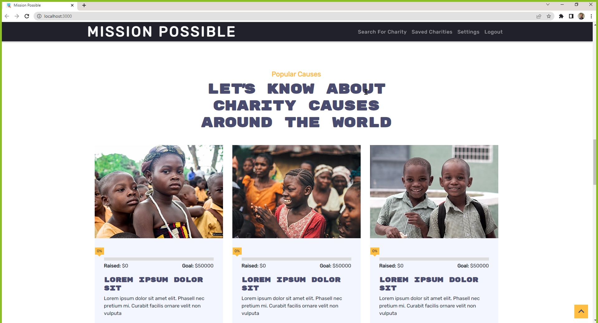

# Mission Possible




## Table of Contents

- [Description](#description)
- [Purpose](#purpose)
- [Deployment](#deployment)
- [Usage](#usage)
- [Technologies](#technologies)
- [Features](#features)
- [Licenses ](#licenses)
- [Installation](#installation)
- [Contributors](#contributors)

## Description

The purpose of this application is to help people find reputable charities who are doing great work for causes around the world. 

This React single-page application was built using Performant JS, a NoSQL database, service workers to make it a progressive web application, we also used Apollo GraphQL, Concurrent servers and JWT for Authentication.

Mobile-first design is built on the fact that users increasingly use their mobile devices to interact with web applications. An application that provides users with the best performance and flexibility is likely to win out over its competitors.


## Purpose

```
<<<<<<< HEAD
AS A BENEFACTOR I WANT TO MAKE DONATIONS THAT WILL DIRECTLY GO TO A CHARITY OR ORGANIZATION OF MY CHOICE

AS A CHARITY ORGANIZER I WANT TO BE ABLE TO RAISE AWARENESS FOR A CHARITY/ORGANIZATION BY ALLOWING BENEFACTORS TO CHOOSE THE CHARITY OF THEIR CHOICE
=======
As a benefactor, I want to make donations to reputable charities of my choice, so that I can donate to  deserving  causes. 

>>>>>>> develop
```

## Deployment

<!-- Update this link -->
A deployed version of this app can be accessed by clicking this [link](http://www.google.ca) 


## Usage

- Create an account to donate to different charities.
- Scroll through the available charities. 
- Read more info about charities by clicking learn more to go to their official sites.  
- Click Donate Button to donate to you selected charity.
- Click Settings to update your account information. 
- Click Contact Us to reach us. 


## Technologies

| Server-Side           | Client-Side   |
| --------------------- | ------------- |
| Apollo-Server-Express | Apollo        |
| Bcrypt                | React-BootStrap    |
| Express               | React         |
| GraphQL               | Stripe        |
| JSON Web Tokens       | Service Workers    |
| Mongoose              |               |
| Axios                 |               |


## Features

- Application is both desktop and mobile friendly.
- PWA allows the app to be used on the go.


## Licenses

Published under the MIT license.

## Installation

- Run `git clone` from this repository: 
- Run `npm install` to install dependencies.
- `npm run develop` will create a development build to experiment with.
- Access the local dev build on http://localhost:3000/ (default).
- If you'd like to play with the API you can access it at http://localhost:3001/graphql

## Contributors

Arslan Razi, Bianca Chami, Daniel Arzanipour, Fabiola Castaneda, Joona Lusa, Vladimir Starchenko


